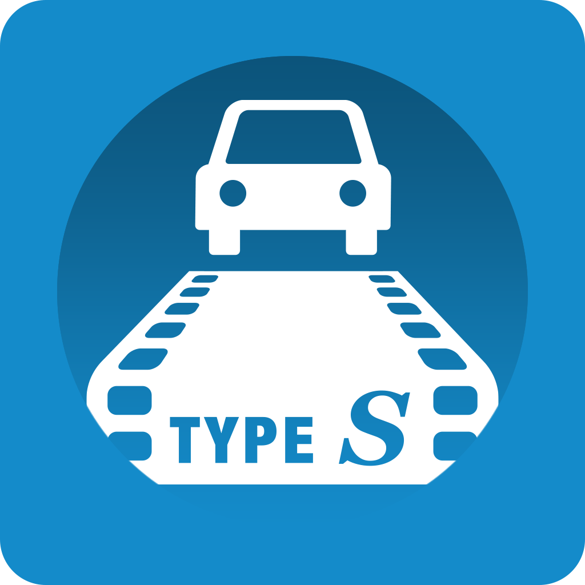
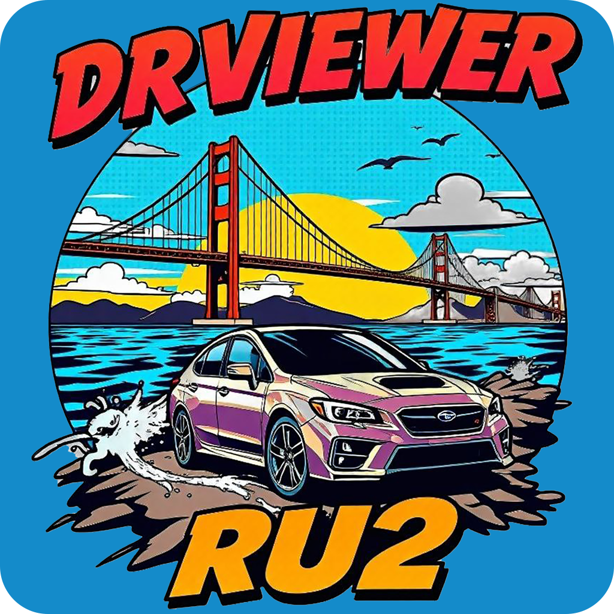
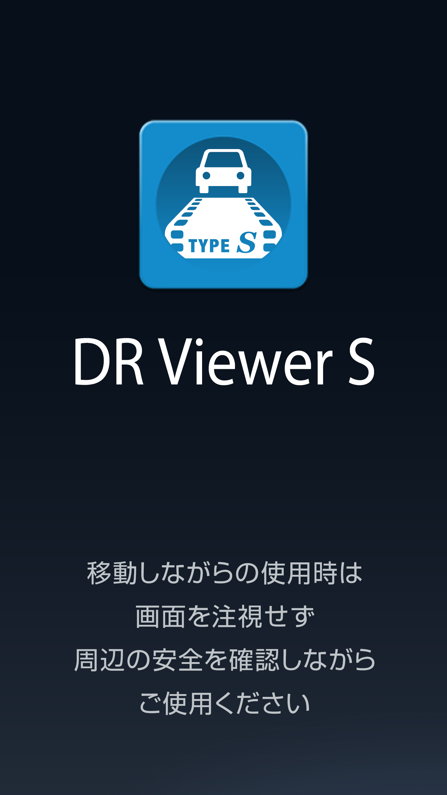
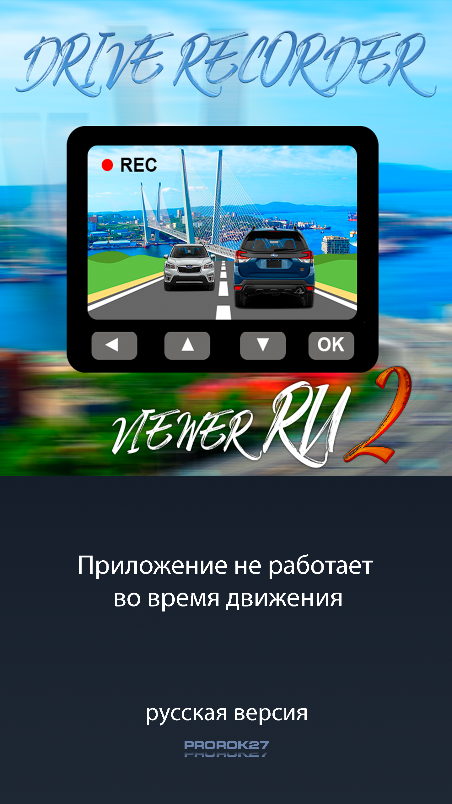
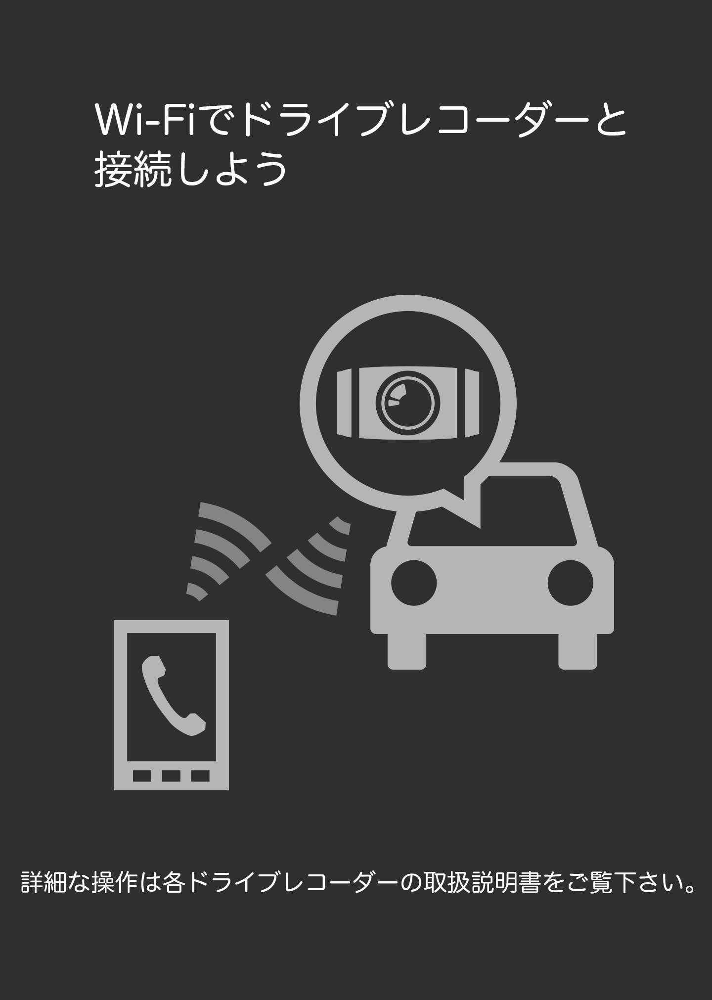
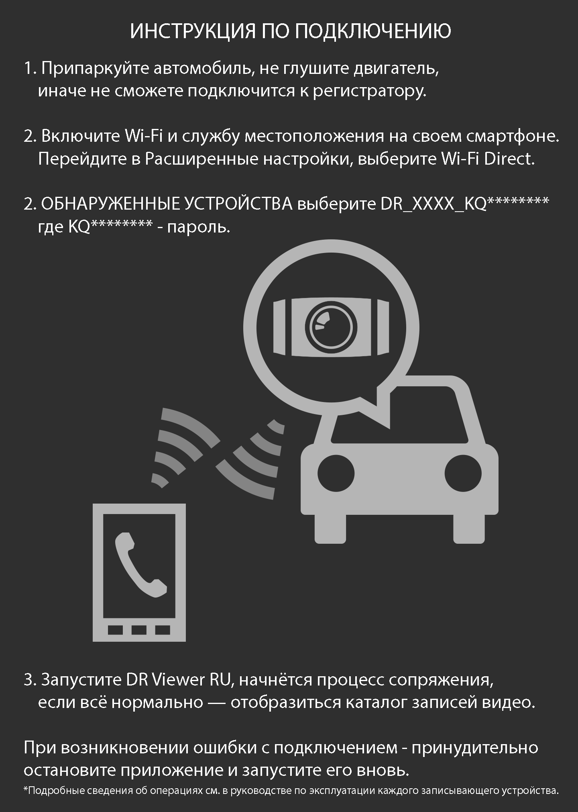
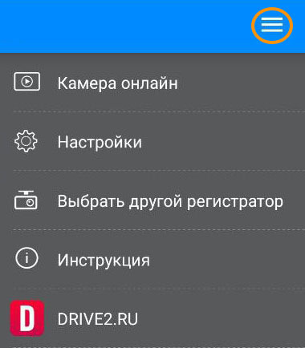
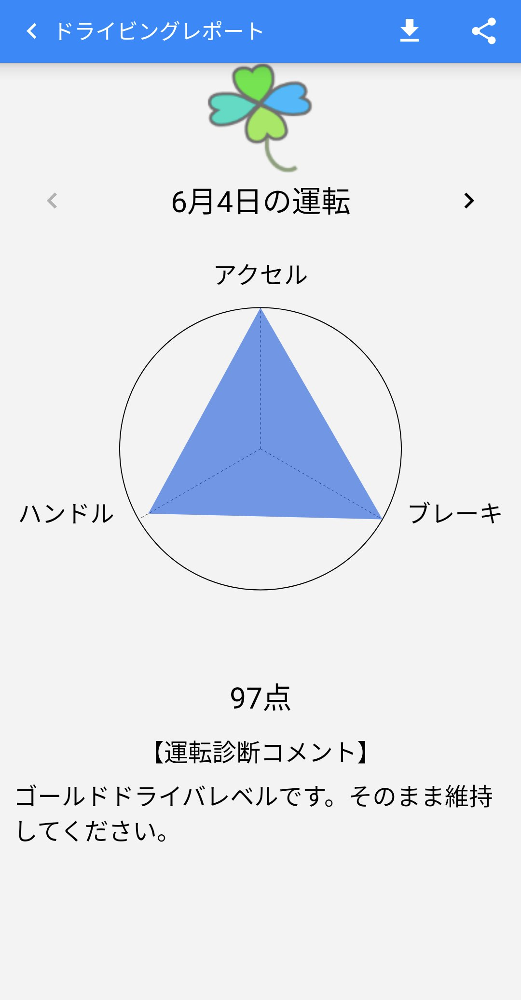
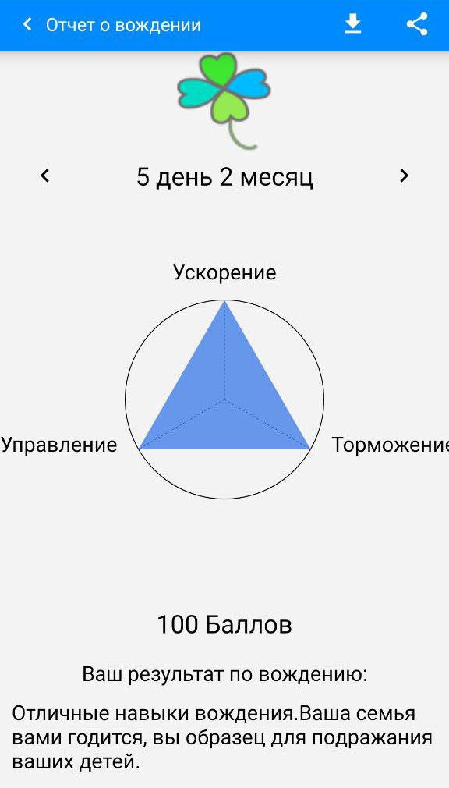
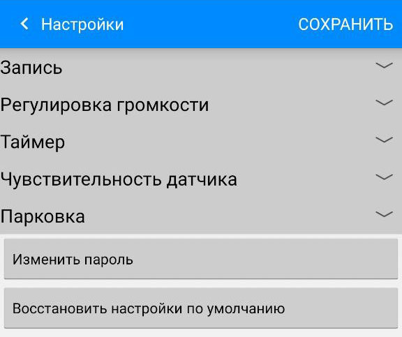

# DR Viewer RU2

**Русифицированное мобильное приложение для видеорегистраторов Subaru (H0013FL100 и аналоги) на Android.**

---

## 📱 О приложении

Это модифицированная версия официального японского приложения **DR Viewer S** (пакет: `jp.co.fujitsu.ten.drecviewer_sep_16cy`), предназначенного для подключения к штатному видеорегистратору Subaru (передняя и задняя камеры) через Wi-Fi Direct.

Основная цель проекта — полная русификация интерфейса и адаптация под российские реалии, чтобы сделать использование регистратора максимально комфортным для русскоязычных пользователей.

**Версия 2 (RU2)** создана на основе актуальной официальной версии **1.9.0**.

---

## 🛠️ Установка

1.  **Скачайте** последнюю версию APK:  
    
2.  **На телефоне:** Разрешите установку из неизвестных источников...

---

## ✨ Что нового в версии 2 (RU2)

Это обновление включает в себя все изменения из первой версии, плюс следующие улучшения:

*   **Актуальная база:** Приложение построено на основе официальной версии **1.9.0**.
*   **Поддержка Android 14:** Полная совместимость с новейшими версиями Android.
*   **Обновленные экраны-заставки:** Заменены графические материалы (слайды) на русскоязычные аналоги.
*   **Улучшенный перевод:** Часть текста была доработана с помощью ИИ для более точных и естественных формулировок (например, корректный перевод термина "Incident").
*   **Все предыдущие изменения сохранены:**
    *   Полная русификация текста интерфейса (более 500 строк).
    *   Перевод встроенной инструкции по подключению.
    *   Установлен часовой пояс по умолчанию **Asia/Vladivostok**.
    *   Изменен формат даты и времени на **`dd.MM.yyyy HH:mm:ss`**.
    *   Ссылка "Политика конфиденциальности" ведет на **`DRIVE2.RU`**.
    *   Изменено название приложения на **"DR Viewer RU2"**.

---

## 🎯 Функциональные возможности (оригинала + русификация)

Приложение позволяет полноценно работать с видеорегистратором:

*   **Основные вкладки:**
    *   **Поездки:** Просмотр и сохранение видео, записанных во время движения (от запуска до остановки двигателя). Отображается информация о местоположении (записывается в файл).
    *   **События:** Отдельные папки для "Все" видео, "Тревожных" (G-сенсор), "Парковка" и "Закладки" (кнопка Event на регистраторе).
    *   **Вождение:** Отчет о стиле вождения с оценками и комментариями по трем параметрам: ускорение, торможение, рулевое управление.
*   **Меню:**
    *   **Камера онлайн:** Прямая трансляция с регистратора (с небольшой задержкой).
    *   **Настройки:** Полный доступ к настройкам регистратора (качество записи, громкость, таймер выключения, чувствительность датчиков, режим парковки и др.).
    *   **Выбор регистратора:** Подключение к другому устройству.
    *   **Инструкция:** Русифицированное руководство по подключению.
    *   **DRIVE2.RU:** Ссылка на сообщество.

---

## 📸 Сравнение "Было / Стало"

Наглядно оцените проделанную работу: интерфейс полностью переведён на русский язык, заменены экраны-заставки, иконка и инструкция.

| **Элемент** | **Оригинал (JP)** | **DR Viewer RU2** |
|:-----------:|:-----------------:|:-----------------:|
| **Иконка** |  |  |
| **Экран приветствия** |  |  |
| **Инструкция** |  |  |
| **Главное меню** |  |  |
| **Отчёт о вождении** |  |  |
| **Настройки** |  |  |

---

## ⚙️ Технические детали и ограничения

### Проблема с Google Картами
В приложении используется Google Maps API (мета-тег `com.google.android.maps.v2.API_KEY` в манифесте). API-ключ разработчика жестко привязан к оригинальной криптографической подписи приложения.

*   **Из-за изменения подписи (при установке модифицированной версии) Google Карты работать не будут.** Само приложение останется полностью стабильным и функциональным, но отображение карты местности станет недоступно.
*   Функция **записи GPS-координат в видео и файлы отчетов продолжает работать**.
*   Сохранить оригинальную подпись при изменении ресурсов (текста, картинок) **невозможно** из-за особенностей криптографической защиты Android.

### Альтернативные варианты для восстановления карт (требуют root-доступа):
1.  **Замена APK в системном разделе:** Установка модифицированного приложения поверх оригинального в `/system/app/` или `/system/priv-app/`. В этом случае система не проверяет подпись.
2.  **Использование Xposed-модуля:** Создание модуля, который подменяет ресурсы (строки, картинки) на лету, оставляя оригинальный APK нетронутым.

Эти способы описаны в соответствующих руководствах и требуют вмешательства в систему.

### Для ПК существует отдельная утилита
На microSD-карте от регистратора присутствует программа **DR Viewer S16** для Windows. Она позволяет просматривать видео на компьютере, видеть трек на Google Картах, анализировать графики скорости/ускорения и менять настройки регистратора.

---

## 🛠️ Установка

1.  **Скачайте** последнюю версию APK из раздела [Releases](https://github.com/yourusername/dr-viewer-ru2/releases) этого репозитория.
2.  **На телефоне:** Разрешите установку из неизвестных источников для вашего браузера или файлового менеджера.
3.  **Удалите** предыдущую версию приложения, если она у вас установлена (из-за конфликта подписей).
4.  Установите скачанный APK-файл.
5.  Подключитесь к Wi-Fi Direct сети вашего регистратора и запустите приложение.

> **Важно:** Приложение модифицировано, поэтому установка поверх официальной версии из магазина или других источников невозможна. Требуется полное удаление старой версии.

---

## 📜 История изменений (Changelog)

*   **Версия 2.0.0 (RU2)** (31.12.2025)
    *   Ребейз на официальную версию **1.9.0**.
    *   Добавлена поддержка Android 14.
    *   Обновлены графические экраны-заставки.
    *   Выполнена дополнительная полировка перевода.
*   **Версия 1.0.0 (RU)** (15.02.2023)
    *   Первая русифицированная версия на базе **1.8.2**.
    *   Перевод всех текстов и инструкции.
    *   Изменение локали и часового пояса по умолчанию.

---

## 📄 Лицензия и авторские права

*   Оригинальное приложение `DR Viewer S` является интеллектуальной собственностью **Fujitsu Ten (E-Iserv)**.
*   Данная модификация создана в личных, некоммерческих целях для сообщества русскоязычных владельцев автомобилей Subaru.
*   Исходный код модификации (патчи, скрипты) распространяется "как есть". Ответственность за использование модифицированной версии несет пользователь.
*   Подробнее о процессе создания можно прочитать в постах на Drive2:
    *   [Руссифицикация мобильного приложения DR Viewer RU + бонус...](https://www.drive2.ru/l/639547157166179394/)
    *   [DR Viewer RU2](https://www.drive2.ru/l/722747476917885263/)

---

## 🙏 Благодарности
Огромное спасибо всем, кто тестировал приложение и делился обратной связью на Drive2. Особая благодарность сообществу за вдохновение и помощь в переводе сложных терминов.

---
